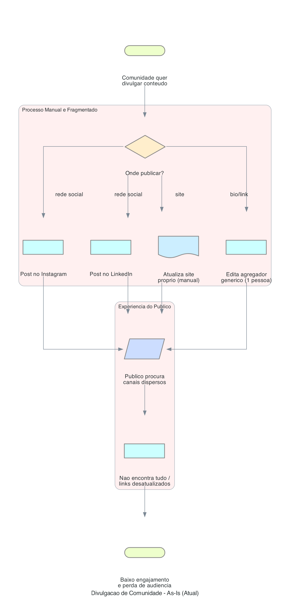
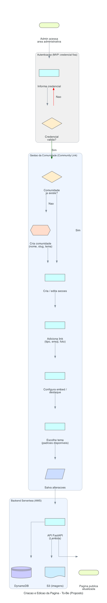
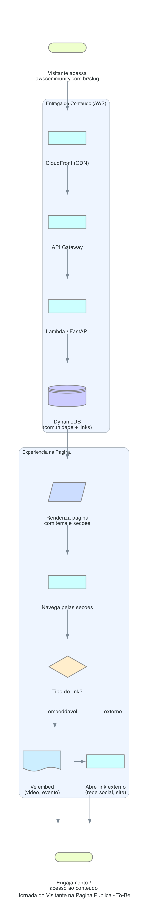
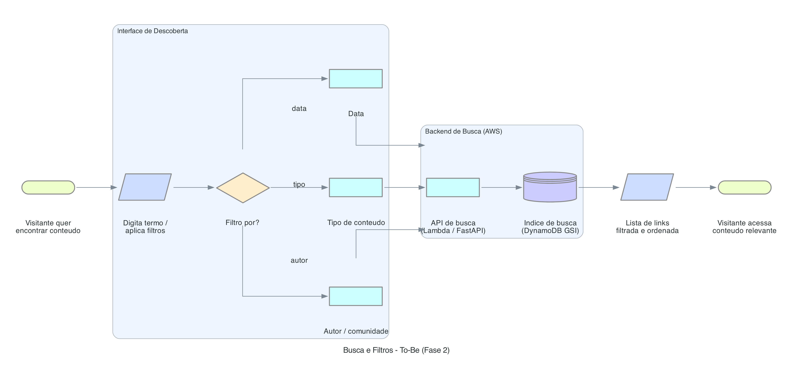
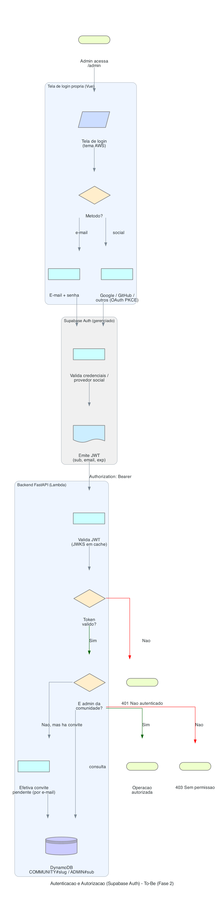

# Community Link — Fluxogramas de Processos

Este diretório contém os fluxogramas dos principais processos do Community Link, gerados com o pacote Python [`diagrams`](https://diagrams.mingrammer.com/). Cada `.py` gera o `.png` correspondente.

Para regenerar as imagens:

```bash
python3 docs/02-fluxograma-processos/as-is-divulgacao.py
python3 docs/02-fluxograma-processos/to-be-edicao-pagina.py
python3 docs/02-fluxograma-processos/to-be-visitante.py
python3 docs/02-fluxograma-processos/to-be-busca-fase2.py
```

> Requisitos: `pip install diagrams` e Graphviz (`brew install graphviz`).

---

## Processo Atual (As-Is)

### Divulgação de Comunidade (fragmentada)



Representa a situação atual: a comunidade divulga conteúdo de forma dispersa em vários canais, sem ponto central, resultando em baixa descoberta e links desatualizados.

#### Descrição das Etapas

| # | Etapa | Responsável | Sistema | Tempo Estimado | Observações |
|---|-------|-------------|---------|----------------|-------------|
| 1 | Comunidade quer divulgar conteúdo | Community manager | — | — | Gatilho do processo |
| 2 | Decide onde publicar | Community manager | — | 5-10 min | Decisão manual e repetida |
| 3 | Post em Instagram / LinkedIn | Community manager | Redes sociais | 10-20 min | Esforço duplicado por canal |
| 4 | Atualiza site próprio | Community manager | Site/CMS | 15-30 min | Manual, propenso a erro |
| 5 | Edita agregador genérico | Community manager | Linktree/similar | 5-15 min | Concentrado em 1 pessoa |
| 6 | Público procura canais dispersos | Visitante | Vários | — | Fricção alta |
| 7 | Não encontra tudo / links desatualizados | Visitante | Vários | — | **Ponto de dor** |
| 8 | Baixo engajamento e perda de audiência | — | — | — | Resultado negativo |

---

## Processo Proposto (To-Be)

### 1. Criação e Edição da Página



O administrador acessa a área administrativa, autentica (no MVP, com credencial fixa), cria/edita a comunidade, organiza seções, adiciona links ricos (tipo, emoji, foto, embed), escolhe o tema e publica. O backend serverless persiste em DynamoDB e imagens em S3.

#### Descrição das Etapas

| # | Etapa | Responsável | Sistema | Tempo Estimado | Observações |
|---|-------|-------------|---------|----------------|-------------|
| 1 | Acessa área administrativa | Admin | Frontend Vue | — | — |
| 2 | Informa credencial | Admin | FastAPI (Lambda) | <1 min | MVP: credencial fixa no backend |
| 3 | Valida credencial | Sistema | FastAPI | <1s | Fluxo definitivo a definir |
| 4 | Cria comunidade (nome, slug, tema) | Admin | Frontend + API | 2-3 min | Slug único (multi-tenant) |
| 5 | Cria/edita seções | Admin | Frontend + API | 1-2 min | Organização temática |
| 6 | Adiciona link (tipo, emoji, foto) | Admin | Frontend + API | 1-2 min/link | Tipos ricos |
| 7 | Configura embed/destaque | Admin | Frontend + API | 1 min | Vídeo, evento, etc. |
| 8 | Escolhe tema (padrões) | Admin | Frontend | <1 min | Customização dentro de padrões |
| 9 | Salva alterações | Admin | API | <1s | — |
| 10 | Persiste dados / imagens | Sistema | DynamoDB + S3 | <1s | — |
| 11 | Página pública atualizada | Sistema | CloudFront | imediato | — |

#### Ganhos Esperados

- Etapas eliminadas: divulgação manual repetida em múltiplos canais.
- Tempo reduzido: manutenção de página de ~30-60 min para poucos minutos.
- Automações aplicadas: persistência serverless, publicação imediata, múltiplos admins.

---

### 2. Jornada do Visitante na Página Pública



O visitante acessa a URL da comunidade (slug), o conteúdo é servido via CloudFront/API Gateway/Lambda a partir do DynamoDB, e navega por seções com links que abrem como embed (vídeo/evento) ou link externo (redes/site).

#### Descrição das Etapas

| # | Etapa | Responsável | Sistema | Tempo Estimado | Observações |
|---|-------|-------------|---------|----------------|-------------|
| 1 | Acessa awscommunity.com.br/slug | Visitante | Navegador | — | URL amigável |
| 2 | CDN entrega conteúdo | Sistema | CloudFront | <200ms | Cache e baixa latência |
| 3 | Roteia requisição | Sistema | API Gateway | <50ms | — |
| 4 | Processa/consulta dados | Sistema | Lambda + DynamoDB | <100ms | — |
| 5 | Renderiza página (tema + seções) | Sistema | Frontend Vue | <1s | Responsivo |
| 6 | Navega pelas seções | Visitante | Frontend | — | Organização temática |
| 7 | Abre embed ou link externo | Visitante | Frontend/Provedores | — | Conforme tipo do link |
| 8 | Engajamento/acesso ao conteúdo | Visitante | — | — | Resultado positivo |

---

### 3. Busca e Filtros (Fase 2)



Na Fase 2, o visitante pode buscar e filtrar conteúdo por data, tipo, autor e comunidade. A API de busca consulta um índice (DynamoDB GSI) e retorna resultados filtrados e ordenados.

#### Descrição das Etapas

| # | Etapa | Responsável | Sistema | Tempo Estimado | Observações |
|---|-------|-------------|---------|----------------|-------------|
| 1 | Quer encontrar conteúdo | Visitante | Frontend | — | Gatilho |
| 2 | Digita termo / aplica filtros | Visitante | Frontend Vue | — | Data, tipo, autor, comunidade |
| 3 | Envia consulta | Sistema | API Gateway + Lambda | <100ms | — |
| 4 | Consulta índice | Sistema | DynamoDB (GSI) | <100ms | Índices por atributo |
| 5 | Retorna lista filtrada/ordenada | Sistema | API | <200ms | — |
| 6 | Acessa conteúdo relevante | Visitante | Frontend | — | Resultado positivo |

#### Ganhos Esperados

- Etapas eliminadas: busca manual em páginas longas.
- Tempo reduzido: descoberta de conteúdo em segundos.
- Automações aplicadas: filtros combinados e indexação para pesquisa.

---

### 4. Autenticação e Autorização com Supabase Auth (Fase 2a)



O administrador faz login em uma **tela própria** (e-mail+senha ou provedor social via OAuth/PKCE). O **Supabase Auth** valida e emite um JWT. O backend valida o token localmente (JWKS em cache) e verifica, no DynamoDB, se o usuário é administrador da comunidade — efetivando convites pendentes por e-mail. Token inválido → 401; sem vínculo → 403.

#### Descrição das Etapas

| # | Etapa | Responsável | Sistema | Tempo Estimado | Observações |
|---|-------|-------------|---------|----------------|-------------|
| 1 | Acessa `/admin` | Admin | Frontend Vue | — | Redireciona para login se não autenticado |
| 2 | Escolhe método (e-mail ou social) | Admin | Tela de login própria | — | Identidade visual do tema `aws` |
| 3 | Valida credenciais / provedor | Sistema | Supabase Auth | <1s | Google, GitHub e demais provedores habilitados |
| 4 | Emite JWT (sub, email, exp) | Sistema | Supabase Auth | <1s | Sessão renovada pelo SDK |
| 5 | Envia `Authorization: Bearer` | Frontend | API | — | Em toda rota administrativa |
| 6 | Valida JWT (JWKS em cache) | Sistema | FastAPI (Lambda) | <10ms | Inválido → 401 |
| 7 | Verifica admin da comunidade | Sistema | DynamoDB | <20ms | `COMMUNITY#slug` / `ADMIN#sub` |
| 8 | Efetiva convite por e-mail | Sistema | DynamoDB | <20ms | `INVITE#email` → `ADMIN#sub` |
| 9 | Autoriza ou nega (403) | Sistema | FastAPI | — | Último admin não pode ser removido |

#### Ganhos Esperados

- Etapas eliminadas: credencial fixa compartilhada.
- Segurança: identidade individual por administrador, login social e MFA do provedor.
- Custo: gratuito até 50 mil usuários ativos/mês; ~US$ 2.950/mês a 1 milhão de MAU.
