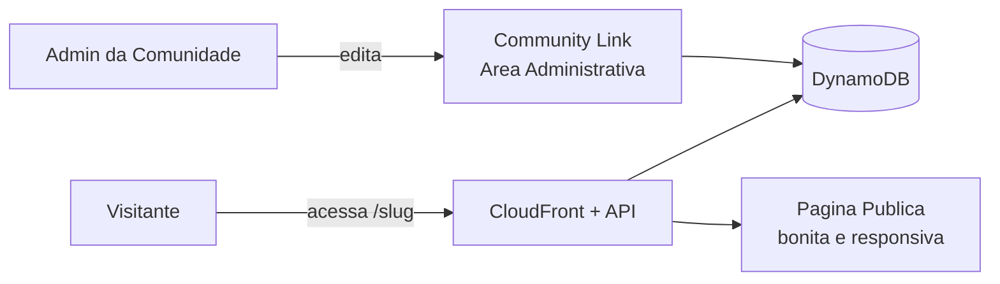

# Resumo Executivo

## Sobre Este Documento

Este documento apresenta, em linguagem executiva, a proposta do **Community Link** — um portal agregador de links para comunidades. Destina-se a patrocinadores, lideranças e stakeholders de decisão. O detalhamento técnico completo está na especificação anexa.

## Contexto e Problema

Comunidades divulgam seus canais e conteúdos de forma fragmentada — redes sociais, site, calendário de eventos e agregadores genéricos vivem isolados. O público não tem um ponto central de acesso, e a manutenção depende de uma única pessoa, gerando desatualização e baixo engajamento.

Principais desafios:

- **Divulgação fragmentada** — sem ponto único de acesso ao conteúdo da comunidade.
- **Ferramentas genéricas** — sem seções temáticas nem múltiplos administradores.
- **Tipos de link pobres** — sem tratamento específico para vídeo, evento, calendário e perfis.
- **Manutenção difícil** — trabalhosa e centralizada, resultando em links desatualizados.
- **Visual inconsistente** — páginas caseiras sem padrão estético nem responsividade.

## Solução Proposta

Uma plataforma **SaaS multi-tenant** na qual cada comunidade cria uma página pública bonita e fácil de manter, com URL própria (ex.: `awscommunity.com.br/minha-comunidade`), organizada em seções, com tipos de link ricos (vídeo, site, calendário, pessoas, LinkedIn, Instagram, TikTok, AWS Builder Center, Meetup), emojis, embeds e fotos de destaque.

Benefícios esperados:

- **Centralização** de toda a presença digital da comunidade em um só lugar.
- **Manutenção simples e colaborativa** (múltiplos administradores).
- **Maior engajamento** com visual profissional e links ricos.
- **Baixo custo operacional** com arquitetura serverless (paga-se pelo uso).

## Escopo e Fases

### Fase 1 — MVP Funcional
- **Objetivo:** entregar a página pública e a edição fácil por comunidade.
- **Entregáveis:** cadastro de comunidade (slug único), seções, tipos ricos de link, emojis, embeds, foto de destaque, temas visuais, página pública responsiva, acesso administrativo simplificado (credencial fixa para testes).
- **Prazo estimado:** a definir com o time (escopo enxuto e incremental).

### Fase 2 — Autenticação e Descoberta
- **Objetivo:** abrir a plataforma a múltiplos administradores com login seguro e facilitar encontrar conteúdo.
- **Entregáveis (2a):** autenticação com **Supabase Auth** — e-mail+senha e login social (Google, GitHub…), tela de login própria, administradores por comunidade e convites por e-mail.
- **Entregáveis (2b):** filtros (data, tipo de conteúdo) e pesquisa (data, conteúdo, autores, comunidades).
- **Custo da autenticação:** gratuito até 50 mil usuários ativos/mês; ~US$ 25/mês até 100 mil; ~US$ 2.950/mês no cenário extremo de 1 milhão de MAU (opção gerenciada mais barata avaliada).
- **Prazo estimado:** após validação da Fase 1.

### Evolução Futura (fora do MVP)
- Analytics de cliques, domínio customizado e monetização.

## Investimento e Retorno

A arquitetura é **serverless** (CloudFront + API Gateway + Lambda + DynamoDB + S3), com cobrança **sob demanda** — não há servidores ociosos. Em baixo volume, grande parte do uso é coberta pelo *free tier* da AWS, mantendo o custo mensal muito baixo e crescendo de forma proporcional ao tráfego.

### Estimativa de Custos AWS

**Link da Calculadora AWS:** [Abrir estimativa](https://calculator.aws/#/estimate?id=e89980819e4b691ff9037523670c7641b6e72d7c)

Cenário MVP (região us-east-1) considerado na estimativa:

| Categoria | Serviços | Premissa de volume (mês) |
|-----------|----------|--------------------------|
| Compute | AWS Lambda | 2 mi requisições, 200 ms, 512 MB (Arm) |
| Networking | API Gateway (REST) | 2 mi requisições |
| Networking | CloudFront (CDN) | 50 GB de transferência, 5 mi requisições HTTPS |
| Database | DynamoDB on-demand | 1 GB, 1 mi escritas + 5 mi leituras |
| Storage | S3 Standard | 5 GB, 50 mil PUT + 500 mil GET |

> Os valores monetários consolidados são exibidos diretamente no link da calculadora acima (fonte oficial). Para o cenário MVP descrito, o custo mensal é baixo (ordem de poucos dólares), pois boa parte do consumo permanece dentro do *free tier*. O custo escala proporcionalmente ao aumento de comunidades e tráfego.

## Próximos Passos

1. Validar o escopo da Fase 1 e priorizar os temas visuais iniciais.
2. Criar o projeto Supabase e configurar os provedores sociais (Google, GitHub) para a Fase 2a.
3. Provisionar a infraestrutura AWS e iniciar o desenvolvimento incremental do MVP.

## Anexos

- **Descritivo de Negócio:** [`docs/01-descritivo-negocio.md`](./01-descritivo-negocio.md)
- **Fluxogramas de Processos:** [`docs/02-fluxograma-processos/`](./02-fluxograma-processos/README.md)
- **Especificação Técnica:** [`docs/03-especificacao-tecnica.md`](./03-especificacao-tecnica.md)
- **Estimativa de Custos AWS:** [calculator.aws](https://calculator.aws/#/estimate?id=e89980819e4b691ff9037523670c7641b6e72d7c)

### Glossário

- **SaaS multi-tenant:** software como serviço que atende várias comunidades na mesma plataforma, com isolamento lógico dos dados.
- **Slug:** identificador amigável na URL de cada comunidade.
- **Serverless:** modelo sem servidores fixos, com cobrança por uso.
- **Embed:** conteúdo de terceiros exibido diretamente na página (ex.: player de vídeo).
